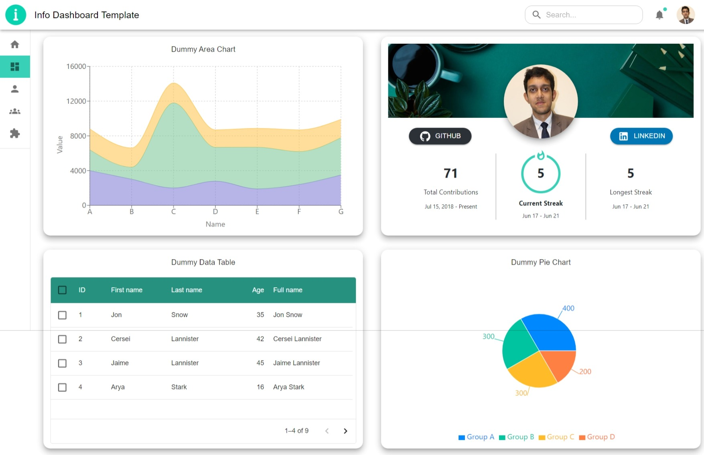
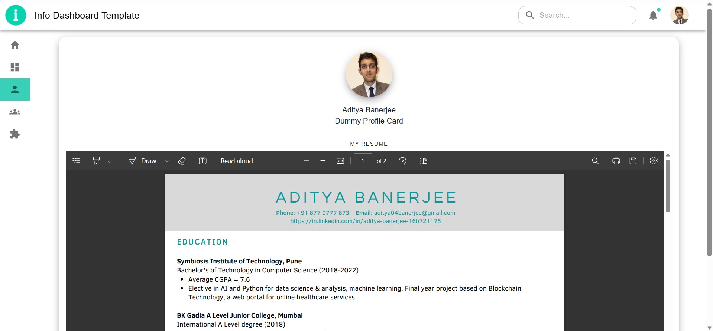

# A Basic Information Dashboard Template

This project is an attempt to make a basic template of a dashboard design to showcase various information through tabs and cards.
\
It includes data about several professional profiles (eg. Github and LinkedIn profiles).\
Credits to [@DenverCoder1](https://github.com/DenverCoder1)'s [github-readme-streak-stats](https://github.com/DenverCoder1/github-readme-streak-stats) for the streak widget which is part of the profile card.\
\
All profile references can be found in the
[LinksandUsernames.ts](src/LinksandUsernames.ts) file and can be changed to show relevant data to you.

## Current App Status - 21st June, 2023

So far, the home, dashboard, and profile pages have relevant components which you can see from the screenshots below. The routing has been implemented but no components exist in the other pages yet.

  
  Home Page 

  
  Dashboard Page 

  
  Profile Page 

## Pre-requisites

Ensure you have a stable version of **nodejs** and **npm** installed in your system.

## Available Scripts

In the project directory, you can run:

### `npm i`

Installs all the dependencies and required libraries in your local repository to ensure the app functions as expected.

### `npm start`

Runs the app in the development mode.\
Open [http://localhost:3000](http://localhost:3000) to view it in the browser.

### `npm test`

Launches the test runner in the interactive watch mode.\

### `npm run build`

Builds the app for production to the `build` folder.\
It correctly bundles React in production mode and optimizes the build for the best performance.

The build is minified and the filenames include the hashes.\
Your app is ready to be deployed!

See the section about [deployment](https://facebook.github.io/create-react-app/docs/deployment) for more information.
