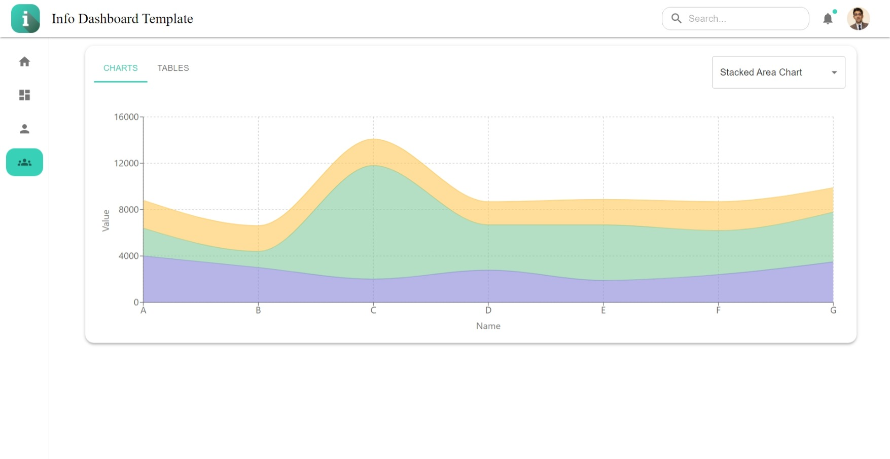

<h1 align="center">A Basic Information Dashboard Template</h1>

This project is a very basic template of a dashboard design to showcase various information through tabs and cards. It includes data about several professional profiles (eg. Github and LinkedIn profiles).\
\
Credits to [@DenverCoder1](https://github.com/DenverCoder1)'s [github-readme-streak-stats](https://github.com/DenverCoder1/github-readme-streak-stats) for the streak widget which is part of the profile card.\
\
All profile references can be found in the
[LinksandUsernames.ts](src/LinksandUsernames.ts) file and can be changed to show relevant data to you.

#

## Current App Status - 26th June, 2023

The app development has been finished, and can be found [here](https://info-dashboard-template.netlify.app/). The final application is deployed using Netlify, and the status of the deployment and other statuses/stats can be seen through the badge below.

#

All screenshots for all pages can be found below.

  
  Home Page 

#

  
  Dashboard Page 

#

  
  Profile Page 

#

  
  Team Page 

#

  
  Error Page 

#

The lighthouse report generated by Netlify for the latest deployed version can be found below.

  
  
LightHouse Report

#

## Pre-requisites

Ensure you have a stable version of **nodejs** and **npm** installed in your system.

## Available Scripts

In the project directory, you can run:

### `npm i`

Installs all the dependencies and required libraries in your local repository to ensure the app functions as expected.

### `npm start`

Runs the app in the development mode.\
Open [http://localhost:3000](http://localhost:3000) to view it in the browser.
